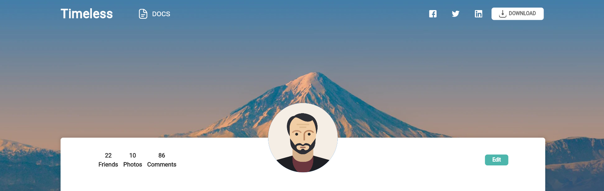
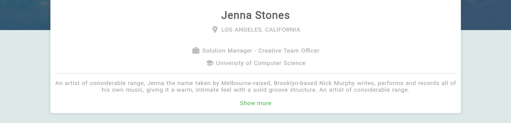
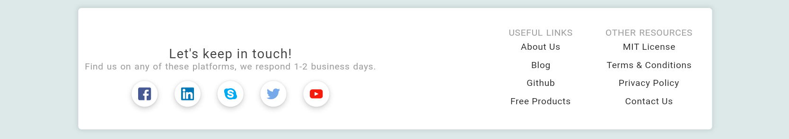
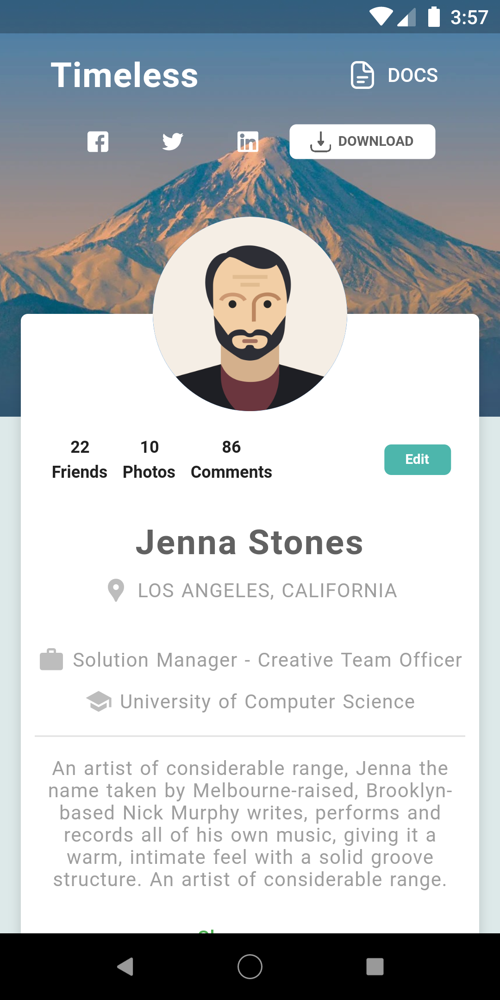
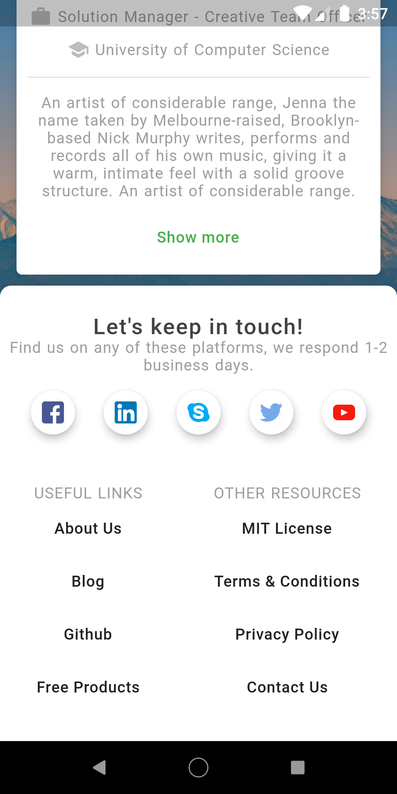

## before clone the GitHub repository please give a star on the repository.

In this video, I am focused on Responsive Profile Ui design. This video for Web and Mobile. This design is suitable for Desktop, Tab, and Mobile platforms.

### Link to the tutorial: https://youtu.be/qKTEGAUFfFU
##
### Web Screenshots
 
 
 
  
 
##
### Mobile Screenshots

 
 
   
   
 
 
 
### Thanks
